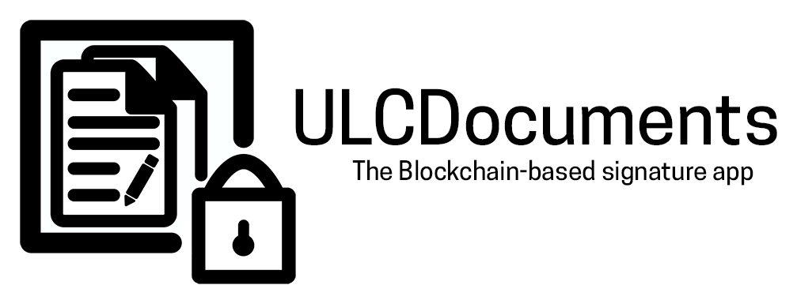

# ULCDocuments

ULCDocuments is a free and open source project aimed at giving everyone a tool to sign all type of files permanently on the Ethereum Blockchain.

ULC is the acronym for **U**ltra **L**ow **C**ost, because signing documents on the blockchain is very cheap.

We can separate the project into two parts:
* The **Blockchain App** which handles the **blockchain**.
* The **Web App**, which is an **implementation** made in javascript to use the Blockchain App.

## Table of Contents:
* [What is Inside this Repo?](#what-is-inside-this-repo)
* [How it Works](#how-it-works)
* [Setup & Configuration](#setup--configuration)
  * [Connection to a Kernel](#connection-to-a-kernel)
  * [Setup Signing](#setup-signing)
* [Usage](#usage)
  * [Checking Signatures](#checking-signatures)
  * [Signing Documents](#signing-documents)
* [Contribute to the Project](#contribute-to-the-project)
* [Who is Behind the Project?](#who-is-behind-the-project)
* [Licenses](#licenses)

## What is Inside this Repo?
In this repo you will find the source code for the *Web App* which communicates with the *Blockchain App*. The *Blockchain App* is currently *closed source*, and its source code will be released when we reach a stable Web App version.

However, a beta version of the ABI files (which handle communication with the blockchain smart contracts) is available in the `ULCDocuments/docs/js/abi` folder.

## How it Works

This app uses two main [Smart Contracts](https://en.wikipedia.org/wiki/Smart_contract): The Kernel and the Moderator.

**The Smart Contract documentation is available [here](https://ulcdocumentscore.readthedocs.io/en/latest/index.html).**

* To be able to sign documents, you must own a **Kernel**. The Kernel is the address where your signatures are stored. It is the main part of the Blockchain Application. It handles multi-operator signing, multi-owner administration and so on. Every moral/physical person can have his own Kernel.

* If users want to check a signature, they must connect to the signatory's Kernel address.

* After creating your Kernel, you can then choose to be referenced on a **Moderator**. This Moderator will then be able to certify your kernel's identity to users connecting to it. Otherwise, users will only see your Kernel address.

> For security reason, it is safer to only use Kernels that are registered on a trustworthy Moderator (such as the **[Blockchain-Elite Moderator](https://ropsten.etherscan.io/address/0x4ad22344ffd31ce4e21397bbad8fe0816d977a0a)** on **Ropsten Testnet**, which is configured by default on the web app).

> **Warning!** Because we are in beta, the default moderator address might change over time. But don't worry, the Web App will be updated to take into account those changes.

# Setup & Configuration

## Connection to a Kernel

### Manual
* Go to https://ulcdocuments.blockchain-elite.fr/ (This repo Github page).
* Click on the **Check** button
* Enter the Ethereum Address of the Kernel you want to connect to in the *Kernel Connection* section.
* Press connect and wait.

### Automatic
Once you are connected to a Kernel, you can save the page in a bookmark, or send the link to someone. Clicking the link will connect you automatically to the Kernel.

The Kernel address is stored in the kernel url parameter as follows:
> ulcdocuments.blockchain-elite.fr/ulcdoc_interactor.html/**#kernel:[ADDRESS].**

## Setup Signing

**!!! WARNING : THIS APP IS STILL IN EARLY BETA. DO NOT USE IT ON MAINNET !!!**

To be able to sign, you must first:
* Have [Metamask](https://metamask.io) installed and configured on your browser (make sure you are connected to the Ropsten network), or use Dapp compatible browser like [Mist](https://github.com/ethereum/mist).
* Be the owner of a Kernel.

**Smart Contracts are not open source yet.** To be able to participate in the beta, **please fill [this form](https://www.blockchain-elite.fr/labs/ulcdocuments-beta-register/)** in order to get a free Kernel.

# Usage

## Checking Signatures

First, make sure you are connected to a [Kernel](#connection-to-a-kernel).

You can check for **Files**, **Raw text** or directly **hashes**.

### Files
* Simply Drag & Drop the file you want to check on the **File** tab, or click the import button.
* Click on the **Check** button, and wait for the results.

### Raw Text
* Go on the **Text** tab and click on "+".
* Write your text.
* Click on the **Check** button, and wait for the results.

### Hashes
* Hash manually your document with correct hash algorithm (SHA3-256 by default).
* Go on the **Hash** tab and click on "+".
* Paste your hash without the "0x" prefix if you have one.
* Click on the **Check** button, and wait for the results.

You can also check several items at the same item.

> Note : you can click on an element's card to display more information, provided by the **Blockchain** (available after checking) or simply **basic file information (size, type, etc...)**

## Signing Documents

**!!! WARNING : THIS APP IS STILL IN EARLY BETA. DO NOT USE IT ON MAINNET !!!**

First, make sure you followed the [setup procedure](#setup-signing).

* Launch the Web App on sign mode by clicking on the **Sign** button in the [Homepage](https://ulcdocuments.blockchain-elite.fr/) or simply reconnect to the kernel and check the **Enable Sign Mode** checkbox.
* Make sure you are on the **Sign a Document** tab.
* Import documents, write text or paste a hash **like you would do on Check** Mode.
* Click on the **Fetch** button. This will check if the documents can be signed (Verifies it they are not already signed, have a signature pending, etc.).
* **Fill in information** about the documents by clicking on them if you wish to. These information will be displayed each time a user checks this document.
* When you are ready, click on the **Sign** button. This will create blockchain transactions and you will be prompted to accept them through your Ethereum connector (Metamask or others).

# Contribute to the Project
This project is Open Source, this means you can help in its development by reporting bugs or requesting new features by [creating a new Issue](https://github.com/blockchain-elite/ULCDocuments/issues).

# Who is Behind the Project?

ULCDocuments is developed as a [Blockchain Elite Labs](https://www.blockchain-elite.fr/labs) project. The goal of those projects is to create Open Source tools using the Blockchain technology, to promote practical blockchain public applications, as well as promoting Blockchain-Elite know-how.

# Licenses
ULCDocuments has a license for the Web App, and an other one for the ABI files (which can be used in other projects):
* [GNU General Public License V3](http://www.gnu.org/licenses/) by default on all files.
* [GNU Lesser General Public License V3](http://www.gnu.org/licenses/) for files that are into the `ULCDocuments/docs/js/abi` folder.
